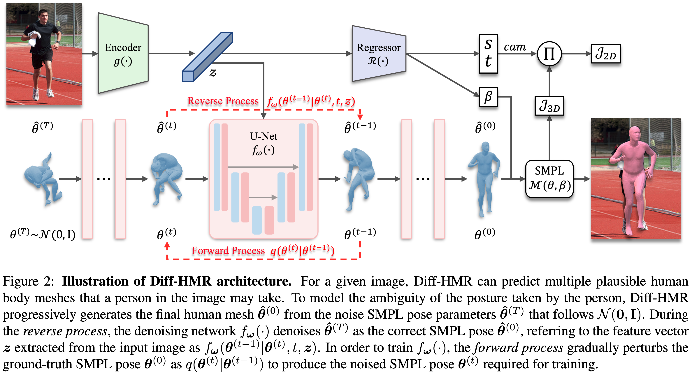

# Diff-HMR: Diffusion-based Human Mesh Recovery (ICCV'23, CV4Metaverse Workshop)

**This is the official PyTorch implementation of the approach described in the following paper:**
> [Generative Approach for Probabilistic Human Mesh Recovery using Diffusion Models](https://arxiv.org/abs/2308.02963)\
> [Hanbyel Cho](https://scholar.google.com/citations?user=VvNXbu8AAAAJ&hl=ko) and [Junmo Kim](https://scholar.google.com/citations?hl=ko&user=GdQtWNQAAAAJ)\
> IEEE/CVF International Conference on Computer Vision ([ICCV](https://iccv2023.thecvf.com/)), 2023, [CV4Metaverse](https://sites.google.com/view/cv4metaverse/home?authuser=0) Workshop

## Abstract
This work focuses on the problem of reconstructing a 3D human body mesh from a given 2D image. Despite the inherent ambiguity of the task of human mesh recovery, most existing works have adopted a method of regressing a single output. In contrast, we propose a generative approach framework, called "Diffusion-based Human Mesh Recovery (Diff-HMR)" that takes advantage of the denoising diffusion process to account for multiple plausible outcomes. During the training phase, the SMPL parameters are diffused from ground-truth parameters to random distribution, and Diff-HMR learns the reverse process of this diffusion. In the inference phase, the model progressively refines the given random SMPL parameters into the corresponding parameters that align with the input image. Diff-HMR, being a generative approach, is capable of generating diverse results for the same input image as the input noise varies. We conduct validation experiments, and the results demonstrate that the proposed framework effectively models the inherent ambiguity of the task of human mesh recovery in a probabilistic manner.



## Dependencies
Make sure you have the following dependencies installed before proceeding:
- Python 3+ distribution
- PyTorch >= 0.4.0

## License
This work is licensed under CC BY-NC. See LICENSE for details. Third-party datasets are subject to their respective licenses.
If you use our code/models in your research, please cite our paper:
```
@InProceedings{Cho_2023_ICCV,
    author    = {Cho, Hanbyel and Kim, Junmo},
    title     = {Generative Approach for Probabilistic Human Mesh Recovery Using Diffusion Models},
    booktitle = {Proceedings of the IEEE/CVF International Conference on Computer Vision (ICCV) Workshops},
    month     = {October},
    year      = {2023},
    pages     = {4183-4188}
}
```

## Acknowledgement
Part of our code is borrowed from [SPIN](https://github.com/nkolot/SPIN) and [denoising-diffusion-pytorch](https://github.com/lucidrains/denoising-diffusion-pytorch).\
Please refer to their project pages for further information.
